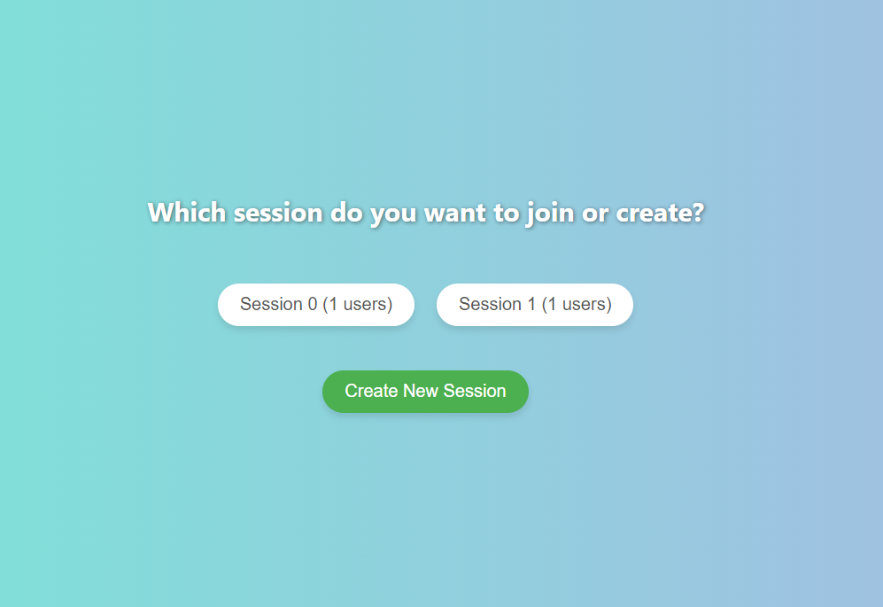
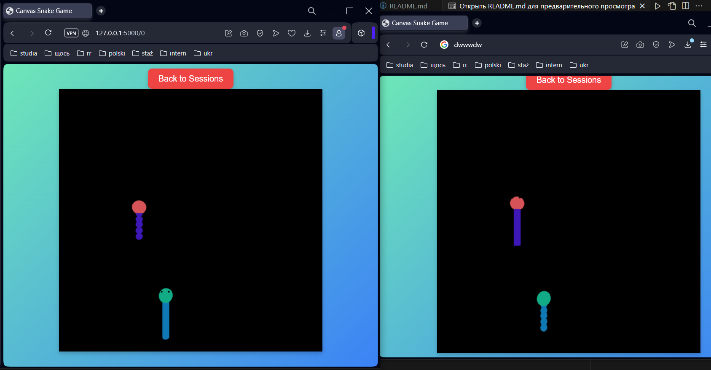
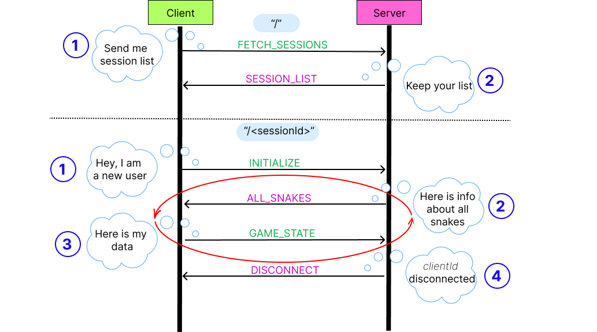

# WebSockets Snake App

<!--
> :warning: **Development Stage:** This application is currently under development and may undergo significant changes. It is a school project designed for educational purposes.
-->

The WebSockets Snake App is a real-time multiplayer snake application built with WebSockets, enabling seamless interaction between players in different sessions. This project uses Flask for the backend and vanilla JavaScript for the frontend, showcasing the power of WebSockets for real-time web applications.





## Features

- **Multiplayer Gameplay:** Join existing game sessions or create new ones to play with others in real-time.
- **Dynamic Session Management:** Players can see active sessions and their participant counts before joining.
- **Real-Time Updates:** Game state updates and player movements are synchronized in real-time across all participants in a session.

## Getting Started

These instructions will get you a copy of the project up and running on your local machine for development and testing purposes.

### Prerequisites

- Python 3.x
- Node.js

### Installing

1. **Clone the Repository**

   ```sh
   git clone https://github.com/RehinaPashkevych/websockets-snakes.git
   cd websockets-snakes
   ```
2. **Activate the Virtual Environment**
    ```sh
   source venv/bin/activate  # On Windows, use `venv\Scripts\activate`
   ```
3. **Start the Flask Server**
   ```sh
   python app.py
   ```
4. **Start the Websocket Server**
   ```sh
   node server.js
   ```

## Communication



These types of messages are implemented to manage communication between the client and server, handling various states and actions within the game application.

`FETCH_SESSIONS` and `SESSION_LIST` types are implemented for  "/" base route, which shows the list of sessions.

### 1. FETCH_SESSIONS
**Direction:** Client -> Server  
**Purpose:** The client requests the list of active game sessions.  
**Message Content:**  
```json
{
  "type": "FETCH_SESSIONS"
}
```

**Code Functionality:**
- The client sends this message every 400ms when on the home page to keep the session list updated.
- Implemented in `client.js` with `socket.send(JSON.stringify({ type: 'FETCH_SESSIONS' }));`.

### 2. SESSION_LIST
**Direction:** Server -> Client  
**Purpose:** The server responds to the client with the list of current game sessions.  
**Message Content:**  
```json
{
  "type": "SESSION_LIST",
  "sessions": {
    "sessionId1": userCount1,
    "sessionId2": userCount2,
    ...
  }
}
```

**Fields:**
- `type`: A string indicating the type of message. Here it is `"SESSION_LIST"`.
- `sessions`: An object where keys are session IDs and values are the number of users in each session.

**Code Functionality:**
- The server constructs this message by iterating over the active sessions and counting users.
- Implemented in `server.js` within the `if (data.type === 'FETCH_SESSIONS')` block.

___

___


The types mentioned above are implemented to facilitate game logic and manage the exchange of information between the client and the server.

### 3. INITIALIZE
**Direction:** Client -> Server  
**Purpose:** The client informs the server of a new or reconnected user, initializing their game state.  
**Message Content:**  
```json
{
  "type": "INITIALIZE",
  "sessionId": "sessionId",
  "clientId": "clientId",
  "snakeInfo": {
    "headColor": "color",
    "bodyColor": "color",
    "headPosition": {
      "x": float,
      "y": float,
      "z": float
    },
   "direction": {
      "x": float,
      "y": float,
      "z": float
    },
  }
}
```

**Fields:**
- `type`: A string indicating the type of message. Here it is `"INITIALIZE"`.
- `sessionId`: The ID of the game session.
- `clientId`: The unique ID of the client.
- `snakeInfo`: An object containing the snake's properties:
  - `headColor`: Color of the snake's head.
  - `bodyColor`: Color of the snake's body.
  - `headPosition`: Position of the snake's head with `x`, `y`, and `z` coordinates.
  - `direction`: Direction of the snake's moving with `x`, `y`, and `z` coordinates.

**Code Functionality:**
- The client sends this message when joins or an existing user reconnects.
- Implemented in `client.js` with `sendInitialData()` function, which is called when the WebSocket connection is opened.

### 4. ALL_SNAKES
**Direction:** Server -> Client  
**Purpose:** The server sends the state of all snakes in the session to the client.  
**Message Content:**  
```json
{
  "type": "ALL_SNAKES",
  "snakes": {
    "clientId1": {
      "headColor": "color",
      "bodyColor": "color",
      "headPosition": {
        "x": float,
        "y": float,
        "z": float
      },
      "direction": {
         "x": float,
         "y": float,
         "z": float
      },
    },
    "clientId2": { ... },
    ...
  }
}
```

**Fields:**
- `type`: A string indicating the type of message. Here it is `"ALL_SNAKES"`.
- `snakes`: An object where keys are client IDs and values are objects containing snake properties (`headColor`, `bodyColor`, `headPosition`, `direction`) for each client.


**Code Functionality:**
- The server sends this message to update the client with the state of all snakes in the session.
- Implemented in `server.js` within the `broadcastSnakes()` function, which is called whenever the state of a snake changes (every 100ms).


### 5. GAME_STATE
**Direction:** Client -> Server  
**Purpose:** The client sends its updated game state to the server.  
**Message Content:**  
```json
{
  "type": "GAME_STATE",
  "sessionId": "sessionId",
  "clientId": "clientId",
  "snakeInfo": {
    "headColor": "color",
    "bodyColor": "color",
    "headPosition": {
      "x": float,
      "y": float,
      "z": float
    },
   "direction": {
      "x": float,
      "y": float,
      "z": float
   },
  }
}
```
**Code Functionality:**
- The client sends this message periodically to update the server with the latest game state.
- Implemented in `client.js` with `sendUpdatedData()` function, which is called during the game loop.


### 6. DISCONNECT
**Direction:** Server -> Client  
**Purpose:** The server informs the client that a client has disconnected.  
**Message Content:**  
```json
{
  "type": "DISCONNECT",
  "clientId": "clientId"
}
```

**Code Functionality:**
- The server sends this message to notify the clients when a user disconnects.
- Implemented in `server.js` within the `ws.on('close', function() { ... })` block, which handles disconnections.
- The client processes this message to remove the disconnected user's snake from the game.
- Implemented in `client.js` with `window.removeSnake(data.clientId);`.


## Description of the Project Files for WebSocket Snakes Game

The WebSocket Snakes project is structured to handle both server-side and client-side functionalities for a multiplayer snake game. Below is a detailed description of the important directories and files necessary for the functionality:

- templates directory:  The templates directory typically contains HTML files that define the structure and content of the web pages served by the Flask application.

   - index.html: The main entry point for the application, providing the structure for the home page. This file likely includes the basic layout, and links to client-side JavaScript and CSS files.

   - game.html: The HTML file that defines the structure for the game interface. This file includes the canvas where the game is rendered and the necessary links to the JavaScript files managing the game logic.

- static directory: The static directory includes all the static assets used by the application, such as JavaScript.

   - JS Files:

       - client.js: Manages WebSocket communication and client-side logic. Handles connection, message sending, and reception, and updates the game state based on server messages.

       -  game.js: Contains the game logic, including snake properties, movement, and rendering. Handles user inputs, updates the game state, and renders the game scene using Three.js. Functions include initializing the game scene, updating snake positions, handling collisions, and saving/loading the game state.

       - index.js: Manages the initial loading and setup of the application, handling user inputs and interactions on the home "/" page.
       

- app.py: This is the main Flask application file. It sets up the server, defines routes, and handles requests. It likely initializes the WebSocket server and manages the overall application logic.

- server.js: Handles WebSocket connections on the server-side. Manages game sessions, receives messages from clients, updates the game state, and broadcasts updates to all connected clients. Key functions include managing new connections, handling incoming messages (INITIALIZE, GAME_STATE, FETCH_SESSIONS), broadcasting updates (ALL_SNAKES, DISCONNECT), and maintaining the game state.

Other files and directories are automatically created for the business logic of the app.

